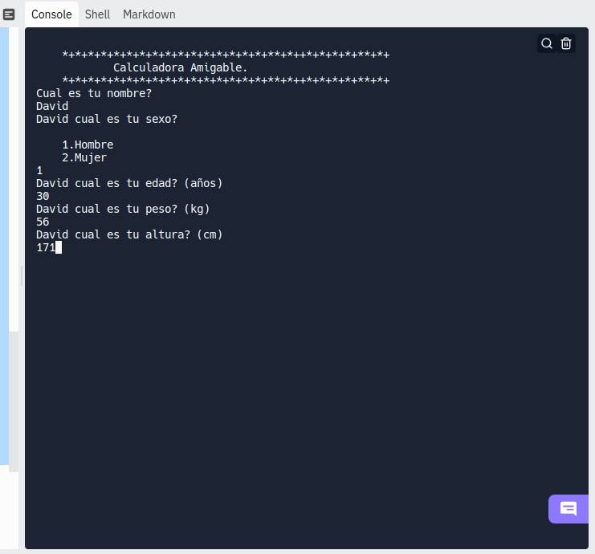
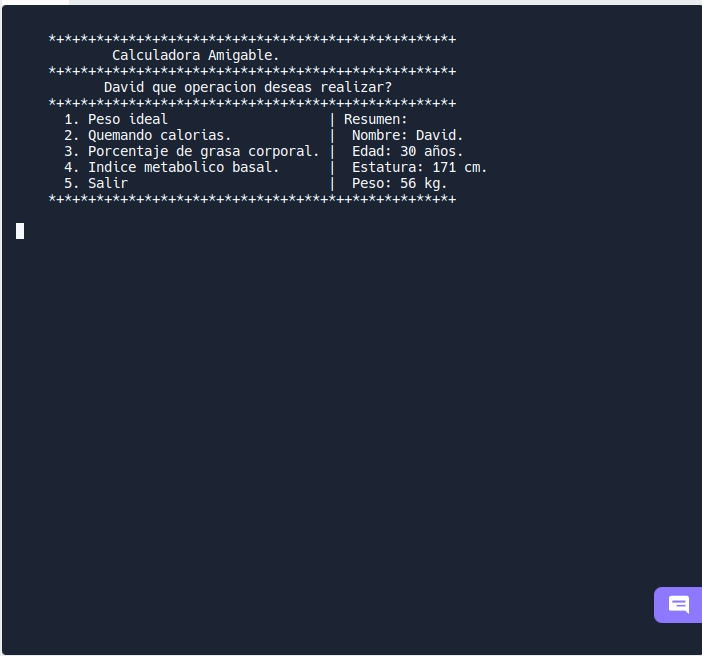
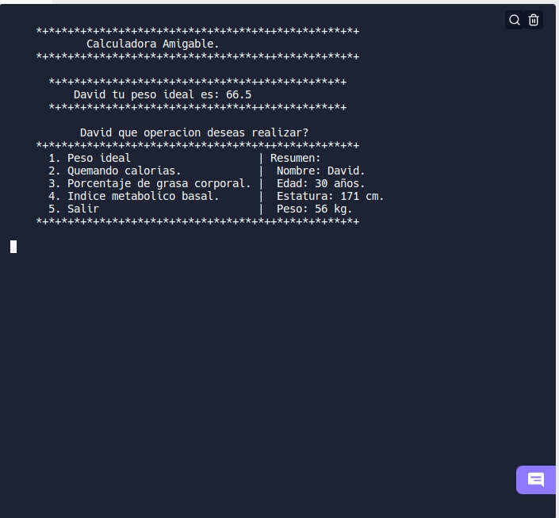

# Calculadora Amigable

## Identificacion

Se nos pide desarrollar un aplicativo con metricas para **"Gente Fitnnes"** . 
>Un aspecto importante para las personas que siguen este estilo de vida son los diferentes indicadores de su estado físico. (peso, grasa, calorías, entre otros).

## Desarrollo

El aplicativo debera solicitar algunos datos al usuario para realizar los calculos corespondientes de pendiendo de la medida solicitada, tambiem podria solicitar todos los datos al usuario desde un inicio.

Esta informacion se usara para generar los siguientes informes:
* Peso ideal.
* Quemando calorias.
* Porcentaje de grasa corporal.
* Indice metabolico basal.

Cada uno de estos sera trabajado cono una funcion independiente llamada al momento de generar el informe solicitado.

## Estrategia
La situacion descrita implica que el ususario tendra que aportar sus datos para poder calcular las respectivas mediciones y generar un informe con los datos aportados.

>**Posibles caminos para el ususario (UX)**

>>Usuario -> Tipo de informe -> Datos

>>Usuario -> Datos -> Tipo de Informe

Sobre cada una de las funciones se aplicaran los datos solicitados segun el informe seleccionado por el usuario.

Teniendo tambien un resumen general el cual tenfra la informacion mas relevante de cada uno de ellos.

## Algoritmos

### 1.  Peso ideal.
Diferentes expertos a través de los años han definido fórmulas
para calcular el peso idea de una persona. Una de las mas usadas
es la del Dr. Miller que establece que el peso ideal para hombres y
mujeres está dado por las fórmulas:
* **Hombre = 56.2 +1.41*(Altura (cm)/2.54 -60)*
* *Mujer = 53.1 +1.36 *(Altura (cm)/2.54 -60))**

**En Python** 
~~~
def IBW(sexo,altura):
  if (sexo == 1):
    pesoI = round(56.2+1.41*((altura/2.54)-60),1)
    print(f"""
      *+*+*+*+*+*+*+*+*+*+*+*+*+*+**+*++*+*+*+*+**+*+
          {nombre} tu peso ideal es: {pesoI}
      *+*+*+*+*+*+*+*+*+*+*+*+*+*+**+*++*+*+*+*+**+*+
          """)
  elif (sexo == 2):
    pesoI = round(53.1+1.36*((altura/2.54)-60),1)
    print(f"""
      *+*+*+*+*+*+*+*+*+*+*+*+*+*+**+*++*+*+*+*+**+*+
          {nombre} tu peso ideal es: {pesoI}
      *+*+*+*+*+*+*+*+*+*+*+*+*+*+**+*++*+*+*+*+**+*+
          """)
  else:
    print("Sexo no valido.\n Seleccione Masculino o Femenino")
~~~
### 2. Quemando calorias.
Si hay algo que les interesa a los deportistas es saber el número de
calorías que se queman durante su actividad, la fórmula para
calcularlas es muy simple:

*Calorías quemadas = (Tiempo actividad (min) * MET * Peso*
(Kg)) /200
**En Python** 
~~~
def quemCalo(peso):

  op=0
  dur=0
  acc=""
  met=0
  qc = 0
  print(f""" *+*+*+*+*+*+*+*+*+*+*+*+*+*+**+*++*+*+*+*+**+*+
              Quemando Calorias
    *+*+*+*+*+*+*+*+*+*+*+*+*+*+**+*++*+*+*+*+**+*+
        """)
  while op != 6:
    print(f"""         {nombre} que actividad deseas realizar?
    *+*+*+*+*+*+*+*+*+*+*+*+*+*+*+*+**+*++*+*+*+*+**+*+
          1. Caminar.
          2. Tenis.
          3. Montar bicicleta.
          4. Correr.
          5. Nadar.
          6. Salir.
    *+*+*+*+*+*+*+*+*+*+*+*+*+*+*+*+**+*++*+*+*+*+**+*+
          """)
    op=int(input())
    if(op==1):
      acc="Caminando"
      met=2
    if(op==2):
      acc="Jugando Tenis"
      met=5
    if(op==3):
      acc="Montando bicicleta"
      met=14
    if(op==4):
      acc="Corriendo"
      met=6
    if(op==5):
      acc="Nadando"
      met=9.8
    if(op==6):
      titulo()
    else:
      "Seleccione una opcion valida"
    print(f"""       {nombre} Cuanto tiempo estuviste {acc}? (min)""")
    
    dur = int(input())
    os.system ("clear")   
    qc = (dur*met*peso)/200
    print(f""" 
          {nombre} tu quema de calorias fue:
          {qc} cal, por estar {acc} durante {dur} min.
          """)
    op = 6

~~~
### 3. Porcentaje de grasa corporal.
Es importante para el deportista la cantidad de grasa corporal que
tiene, las fórmulas para calcular el porcentaje del peso de una
persona que es grasa son:
* Hombres adultos = 1.20 * IMC + 0.23 * Edad - 16.2
* Mujeres adultas = 1.20 * IMC + 0.23 * Edad - 5.4

Donde IMC es el índice de masa corporal que se calcula de la
siguiente manera:
• IMC = peso (Kg) / Altura2 (m)

**En Python** 
~~~
def pGC():
  porcent = 0
  imc= peso/altura
  if(sexo==1):
    porcent= round(1.20*imc+0.23*(edad-16.2),2)
    print(f"""
        {nombre}, tu porcentaje de grasa corporal es: {porcent}%
        """)
  elif(sexo==2):
    porcent= round(1.20*imc+0.23*(edad-5.4),2)
    print(f"""
        {nombre}, tu porcentaje de grasa corporal es:{porcent}% """)
~~~
### 4. Indice metabolico basal.
El índice metabólico basal o la tasa metabólica basal (TMB) indica
la cantidad de calorías que necesita el cuerpo para realizar las
funciones metabólicas básicas, como mantener los órganos vitales
en funcionamiento. Se calcula con las siguientes formulas
* Hombres = 13.397P + 4.799E - 5.677A + 88.362
* Mujeres = 9.247P + 3.098E - 4.330A + 447.593

**En Python**
~~~
def IMB():
  ind=0
  if(sexo==1):
    ind= round((13397*peso)+(4799*edad)-(5677*altura)+88362,2)
    print(f"""
        {nombre}, tu indice metabolico basal es: {ind}. """)
  elif(sexo==2):
    ind= round((9247*peso)+(3098*edad)-(4330*altura)+47593,2)
    print(f"""
        {nombre}, tu indice metabolico basal es: {ind}. """)
~~~

#### Tambien se definieron las funciones *titulo* y *menuOp*

Estas funciones son creadas para mejorar la experiencia de usuario y ahorrar codigo

**Funcion *titulo* en Python**
~~~
def titulo():
  print("""
    *+*+*+*+*+*+*+*+*+*+*+*+*+*+*+*+**+*++*+*+*+*+**+*+
            Calculadora Amigable.
    *+*+*+*+*+*+*+*+*+*+*+*+*+*+*+*+**+*++*+*+*+*+**+*+""")
~~~
**Funcion *titulo* en Python**
~~~
def menuOp():
  op=0
  titulo()
  while op != 5:
    print(f"""           {nombre} que operacion deseas realizar?
    *+*+*+*+*+*+*+*+*+*+*+*+*+*+*+*+**+*++*+*+*+*+**+*+
      1. Peso ideal                    | Resumen: 
      2. Quemando calorias.            |  Nombre: {nombre}. 
      3. Porcentaje de grasa corporal. |  Edad: {edad} años. 
      4. Indice metabolico basal.      |  Estatura: {altura} cm.
      5. Salir                         |  Peso: {peso} kg.
    *+*+*+*+*+*+*+*+*+*+*+*+*+*+*+*+**+*++*+*+*+*+**+*+
          """)
    op=int(input())
    os.system ("clear")  
    if(op) == 1:
      titulo()
      IBW(sexo,altura)
    elif(op) == 2:
      titulo()
      quemCalo(peso)
    elif(op) == 3:
      titulo()
      pGC()
    elif(op) == 4:
      titulo()
      IMB()
    elif(op) == 5:
      print("Saliendo.")
    else:
      print(f"{nombre}, seleccione una opcion valida.")
titulo()
#Solicito los datos al usuario
nombre=input("Cual es tu nombre?\n")
sexo=(int(input(f"""{nombre} cual es tu sexo?\n
    1.Hombre
    2.Mujer\n""")))
edad=int(input(f"{nombre} cual es tu edad? (años)\n"))
peso=int(input(f"{nombre} cual es tu peso? (kg)\n"))
altura=int(input(f"{nombre} cual es tu altura? (cm)\n"))
os.system ("clear")  
menuOp()
~~~

# Logros

